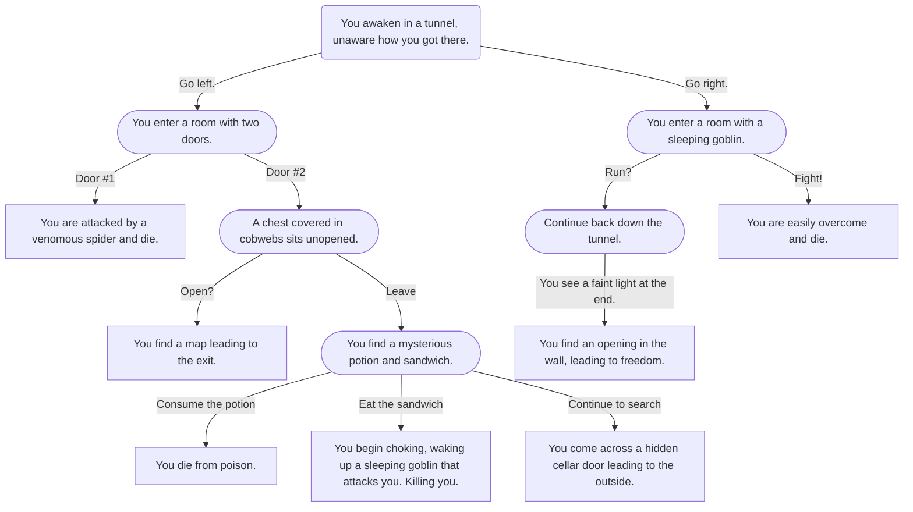

## Mermaid Diagram 
### _CHOOSE YOUR OWN ADVENTURE!_

```mermaid
    flowchart TD
    A(You awaken in a tunnel, unaware how you got there.) -->|Go left.| B([You enter a room with two doors.])
    A -->|Go right.| C([You enter a room with a sleeping goblin.])
    B -->|Door #1| D[You are attacked by a venomous spider and die.]
    B -->|Door #2| E([A chest covered in cobwebs sits unopened.])
    C -->|Run?| F([Continue back down the tunnel.])
    C -->|Fight!| H[You are easily overcome and die.]
    E -->|Open?| G[You find a map leading to the exit.]
    F -->|You see a faint light at the end.| I[You find an opening in the wall, leading to freedom.]
    E -->|Leave| J([You find a mysterious potion and sandwich.])
    J -->|Consume the potion|K[You die from poison.]
    J -->|Eat the sandwich| L[You begin choking, waking up a sleeping goblin that attacks you. Killing you.]
    J -->|Continue to search| M[You come across a hidden cellar door leading to the outside.]
```
