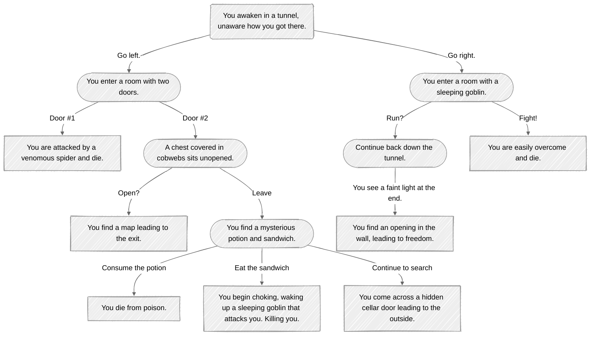

## Mermaid Diagram 
### _CHOOSE YOUR OWN ADVENTURE!_

##### *Description:*
Above we have a simple Mermaid flowchart that highlights the ease of using text and simple brackets to create a quick easy to follow  
chart. Starting from the top you *"Wake up in a dark tunnel without any idea how you arrived, but only two options are in front of you..."*.  
So now you decide your fate by choosing one of the two options to progress through and **_hopefully_** make it out alive.  
> [Using MermaidChart](https://www.mermaidchart.com/app/projects/d14bca98-3880-43db-a82e-28e39b33562c/diagrams/e28d4867-a617-47de-b5f2-c7a918c74750/version/v0.1/edit) allows you 
to write code and make changes while seeing a live display of your chart. With visual diagram options available  you can configure one to best suit your needs. 
